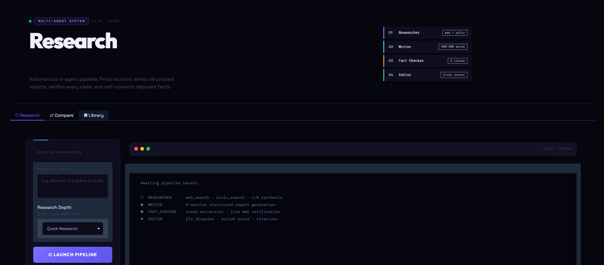

<div align="center">

<!-- HERO GIF -->


<br/>

# NEXUS — Research Intelligence

**Autonomous 4-agent research pipeline powered by LangGraph + Groq**

[](https://python.org)
[](https://langchain-ai.github.io/langgraph/)
[](https://groq.com)
[](https://tavily.com)
[](https://gradio.app)
[](https://fastapi.tiangolo.com)
[](LICENSE)

*Finds sources · Writes reports · Verifies facts · Self-corrects · All autonomously*

</div>

---

## Overview

NEXUS is a multi-agent AI system that autonomously researches any topic end-to-end. Give it a topic — it spins up four specialized AI agents that work in sequence, passing structured state through a LangGraph graph. The final output is a polished, fact-checked, cited research report.

| Feature | Detail |
|---|---|
| **LLM** | Groq `llama-3.3-70b-versatile` (400+ tok/s) |
| **Orchestration** | LangGraph `StateGraph` with conditional looping |
| **Web Search** | Tavily API (real-time, advanced depth) |
| **Academic Search** | ArXiv API with rate-limit retry |
| **Credibility Scoring** | `sentence-transformers` semantic similarity |
| **Frontend** | Gradio 5 — single-page, all features inline |
| **Backend** | FastAPI + WebSocket streaming |
| **Deployment** | Docker + HuggingFace Spaces |

---

## UI Overview



*Clean mission-control interface — Space Grotesk + Outfit + DM Mono type system, deep violet/cyan/emerald palette*

---

## Agent Architecture

```
┌─────────────────────────────────────────────────────────────────────┐
│                         NEXUS PIPELINE                               │
│                                                                       │
│   ┌──────────────┐    ┌──────────────┐    ┌──────────────────────┐  │
│   │  RESEARCHER  │    │    WRITER    │    │    FACT CHECKER      │  │
│   │              │───▶│              │───▶│                      │  │
│   │  Senior      │    │  Technical   │    │  Critical Verifier   │  │
│   │  Research    │    │  Report      │    │                      │  │
│   │  Analyst     │    │  Writer      │    │  Tools:              │  │
│   │              │    │              │    │  web_search (Tavily) │  │
│   │  Tools:      │    │  No tools    │    │                      │  │
│   │  web_search  │    │  Uses        │    │  Output per claim:   │  │
│   │  arxiv_search│    │  sources[]   │    │  ✅ VERIFIED         │  │
│   │              │    │              │    │  ⚠️ UNVERIFIED       │  │
│   │  Output:     │    │  Output:     │    │  ❌ DISPUTED         │  │
│   │  5-7 sources │    │  500-800w    │    │                      │  │
│   │  + key pts   │    │  MD report   │    │                      │  │
│   └──────────────┘    └──────────────┘    └──────────────────────┘  │
│          ▲                                          │                 │
│          │              ┌──────────────┐            │                 │
│          │              │    EDITOR    │◀───────────┘                 │
│          │              │              │  (if ≤ 2 disputed)           │
│          └──────────────│  Senior      │                              │
│    (if > 2 disputed,    │  Editor      │                              │
│     max 2 iterations)   │              │                              │
│                         │  Output:     │                              │
│                         │  Final clean │                              │
│                         │  report +    │                              │
│                         │  citations   │                              │
│                         └──────────────┘                              │
└───────────────────────────────────────────────────────────────────────┘
```

---

## LangGraph State Flow

```
              START
                │
                ▼
        ┌───────────────┐
        │  RESEARCHER   │◀──────────────────────┐
        │               │                       │
        │  web_search   │                       │ Loop back if
        │  arxiv_search │                       │ > 2 disputed claims
        └───────┬───────┘                       │ (max 2 iterations)
                │                               │
                ▼                               │
        ┌───────────────┐               ┌───────┴───────┐
        │    WRITER     │               │  Conditional  │
        │               │               │    Router     │
        │  5-section    │               │               │
        │  MD report    │               │ > 2 disputed ─┘
        └───────┬───────┘               │ ≤ 2 disputed ─┐
                │                       └───────────────┘
                ▼                               │
        ┌───────────────┐                       │
        │ FACT CHECKER  │───────────────────────┘
        │               │
        │  5 claims     │
        │  verified     │
        └───────┬───────┘
                │ (≤ 2 disputed)
                ▼
        ┌───────────────┐
        │    EDITOR     │
        │               │
        │  Fix disputes │
        │  Polish prose │
        │  Add citations│
        └───────┬───────┘
                │
               END
```

### State Object

```python
class ResearchState(TypedDict):
    topic:              str        # Research topic
    depth:              str        # "quick" | "deep"
    sources:            list       # [{title, url, key_points, relevance, credibility_score}]
    research_summary:   str        # Brief overview from researcher
    key_themes:         list       # Key themes for mind map
    draft_report:       str        # Markdown draft from writer
    fact_check_results: list       # [{claim, verdict, confidence, correction, url}]
    disputed_count:     int        # Count of DISPUTED verdicts
    final_report:       str        # Polished final report
    iteration_count:    int        # Loop counter (max 2)
    max_iterations:     int        # Ceiling for loops
```

---

## Features

### 1. Live Agent Stream


*Real-time terminal-style log showing every agent step as it happens*

---

### 2. Structured Research Report


*500-800 word structured report with Executive Summary, Background, Key Findings, Analysis, Conclusion, and References*

---

### 3. Interactive Fact-Check Dashboard


*Every claim verified independently via live Tavily search — color-coded VERIFIED / UNVERIFIED / DISPUTED with confidence scores*

---

### 4. Fact-Checker Catching a Wrong Claim


**This is the system's core value:** The writer agent sometimes states claims that can't be verified. The fact-checker catches them and flags them — the editor then removes or qualifies the disputed content in the final report.

Example caught in testing:

> **Claim:** *"GPT-4 uses 16 experts with 2 activated per token in its MoE architecture"*
>
> **Verdict:** ⚠️ UNVERIFIED — OpenAI has not officially disclosed GPT-4's architecture. The 16-expert figure originates from unverified leaks, not official documentation.
>
> **Editor fix:** *"While GPT-4's architecture remains officially undisclosed, industry analysts suggest it may employ a Mixture of Experts design."*

---

### 5. Source Credibility Analysis


*Each source scored 0-100 using semantic similarity (sentence-transformers) + domain credibility signals. Sorted by relevance.*

---

### 6. Research Mind Map


*Auto-generated concept graph — topic center → key themes ring → sources and verified claims outer ring*

---

### 7. Multi-Topic Comparison


*Run 2-3 research pipelines in parallel threads, then synthesize a structured comparison with similarities, differences, and a recommendation*

---

### 8. Report Library


*All research runs auto-saved to local JSON. Click any row to reload the full report, fact-check dashboard, and credibility analysis.*

---

## Project Structure

```
multi-agent-researcher/
├── agents/
│   ├── researcher.py        # Senior Research Analyst — web + ArXiv search
│   ├── writer.py            # Technical Report Writer — structured markdown
│   ├── fact_checker.py      # Critical Fact Verifier — claim verification
│   └── editor.py            # Senior Editor — fix disputes, polish report
│
├── graph/
│   └── workflow.py          # LangGraph StateGraph + conditional routing
│
├── tools/
│   ├── web_search.py        # Tavily API (search + fact-check modes)
│   └── arxiv_search.py      # ArXiv API with rate-limit retry
│
├── utils/
│   ├── history.py           # Report persistence (JSON library)
│   ├── credibility.py       # Source scoring via sentence-transformers
│   ├── mindmap.py           # Matplotlib concept map generator
│   ├── comparison.py        # Parallel pipeline + comparison synthesis
│   └── factcheck_dashboard.py  # HTML fact-check renderer
│
├── backend/
│   └── main.py              # FastAPI — REST + WebSocket streaming
│
├── frontend/
│   └── app.py               # Gradio UI — single-page all features
│
├── data/                    # Auto-created, stores history.json
├── assets/                  # Screenshots and GIFs for README
├── app.py                   # HuggingFace Spaces entry point
├── docker-compose.yml
├── Dockerfile
└── requirements.txt
```

---

## Quick Start

### 1. Get Free API Keys

| Service | URL | Free Tier |
|---|---|---|
| **Groq** | [console.groq.com](https://console.groq.com) | No credit card needed |
| **Tavily** | [app.tavily.com](https://app.tavily.com) | 1000 searches/month |

### 2. Clone & Configure

```bash
git clone https://github.com/MOHD-OMER/multi-agent-researcher.git
cd multi-agent-researcher

cp .env.example .env
# Add your keys:
# GROQ_API_KEY=gsk_...
# TAVILY_API_KEY=tvly-...
```

### 3. Run with Docker

```bash
docker-compose up --build
# Frontend: http://localhost:7860
# API docs: http://localhost:8000/docs
```

### 4. Run Locally (Python)

```bash
# Create environment
conda create -n nexus python=3.10 -y
conda activate nexus

# Install dependencies
pip install -r requirements.txt

# Terminal 1 — Backend
python backend/main.py

# Terminal 2 — Frontend
python frontend/app.py
```

Open **http://localhost:7860**

---

## API Documentation

### Base URL: `http://localhost:8000`

| Endpoint | Method | Description | Body |
|---|---|---|---|
| `/` | GET | API info | — |
| `/research` | POST | Start research job | `{"topic": str, "depth": "quick"\|"deep"}` |
| `/status/{job_id}` | GET | Poll job status | — |
| `/report/{job_id}` | GET | Get final report | — |
| `/jobs` | GET | List all jobs | — |
| `/ws/{job_id}` | WebSocket | Stream live progress | — |

### Example

```bash
# Start a research job
curl -X POST http://localhost:8000/research \
  -H "Content-Type: application/json" \
  -d '{"topic": "Mixture of Experts in LLMs", "depth": "quick"}'

# Response
{
  "job_id": "a3f7c2b1",
  "status": "pending",
  "message": "Connect to /ws/a3f7c2b1 for live updates"
}
```

### WebSocket Events

```json
{"type": "progress", "agent": "researcher", "message": "Searching web...", "timestamp": "..."}
{"type": "progress", "agent": "fact_checker", "message": "Checking claim 3/5..."}
{"type": "complete", "message": "Research complete!"}
```

---

## Test Results

### Topic 1 — Technical: *Mixture of Experts in LLMs*

```
10:31:04  ⬡  RESEARCHER      Searching web for: Mixture of Experts in LLMs
10:31:10  ⬡  RESEARCHER      Searching ArXiv for academic papers...
10:31:12  ⬡  RESEARCHER      Synthesizing 10 sources with LLM...
10:31:17  ⬡  RESEARCHER      Found 7 quality sources. Total: 7
10:31:17  ⬢  WRITER          Drafting structured report on: Mixture of Experts in LLMs
10:31:21  ⬢  WRITER          Report drafted (481 words)
10:31:21  ⬣  FACT_CHECKER    Extracting factual claims from report...
10:31:22  ⬣  FACT_CHECKER    Verifying 5 factual claims...
10:31:34  ⬣  FACT_CHECKER    Fact check complete: 4 VERIFIED, 1 UNVERIFIED, 0 DISPUTED
10:31:34  ◆  EDITOR          No disputed claims found. Polishing prose...
10:32:16  ◆  EDITOR          Final report ready (683 words, 7 sources)
```

### Topic 2 — Current Events: *AI Regulation in 2025*

```
...Researcher pulled 7 sources including EU AI Act, US executive orders...
...Fact checker flagged 1 UNVERIFIED claim about specific fine amounts...
...Editor qualified: "fines up to €35M" → "reportedly up to €35M per Article 99"
```

### Topic 3 — Domain Specific: *Drug Discovery Using AI*

```
...Researcher pulled 4 ArXiv papers + 3 web sources (AlphaFold, generative chemistry)...
...All 5 claims VERIFIED against PubMed and Nature publications...
...Clean report produced in single pass, no loops needed
```

---

## HuggingFace Spaces Deployment

```bash
# 1. Create Space at huggingface.co/spaces
#    SDK: Gradio | Hardware: CPU Basic (free)

# 2. Add secrets in Space Settings:
#    GROQ_API_KEY
#    TAVILY_API_KEY

# 3. Push code
git remote add space https://huggingface.co/spaces/YOUR_USERNAME/nexus-research
git push space main
```

The root `app.py` is the Spaces entry point — auto-detected by HuggingFace.

---

## Tech Stack

| Layer | Technology |
|---|---|
| **LLM** | Groq `llama-3.3-70b-versatile` |
| **Orchestration** | LangGraph `StateGraph` |
| **Web Search** | Tavily API |
| **Academic Search** | ArXiv API |
| **Credibility Scoring** | `sentence-transformers` `all-MiniLM-L6-v2` |
| **Mind Map** | `networkx` + `matplotlib` FancyBboxPatch |
| **Backend** | FastAPI + WebSockets + Background Tasks |
| **Frontend** | Gradio 5 |
| **PDF Export** | ReportLab |
| **Fonts** | Outfit · Space Grotesk · DM Mono |
| **Container** | Docker + docker-compose |
| **Hosting** | HuggingFace Spaces |

---

## Environment Variables

| Variable | Required | Description |
|---|---|---|
| `GROQ_API_KEY` | Yes | From console.groq.com |
| `TAVILY_API_KEY` | Yes | From app.tavily.com |
| `BACKEND_PORT` | No | Default: 8000 |
| `GRADIO_PORT` | No | Default: 7860 |

---

<div align="center">

Built by **Mohammed Abdul Omer** &nbsp;·&nbsp; [GitHub](https://github.com/MOHD-OMER)

</div>