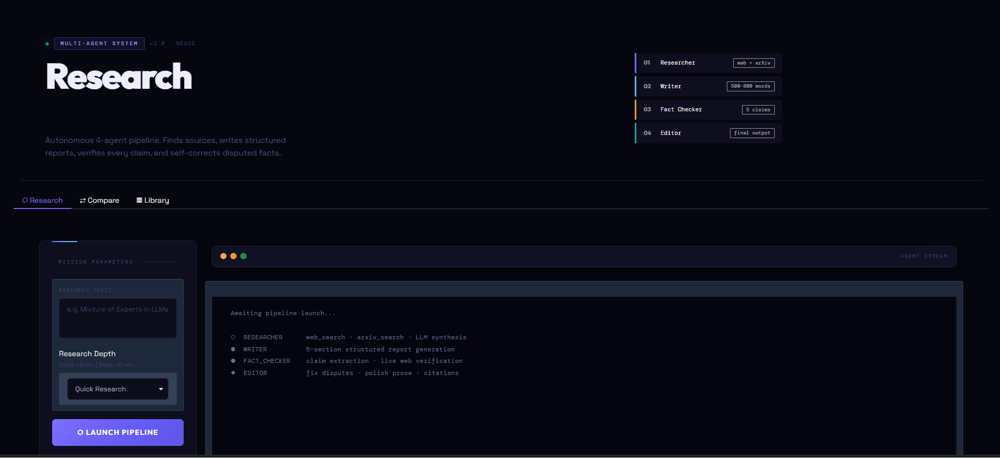
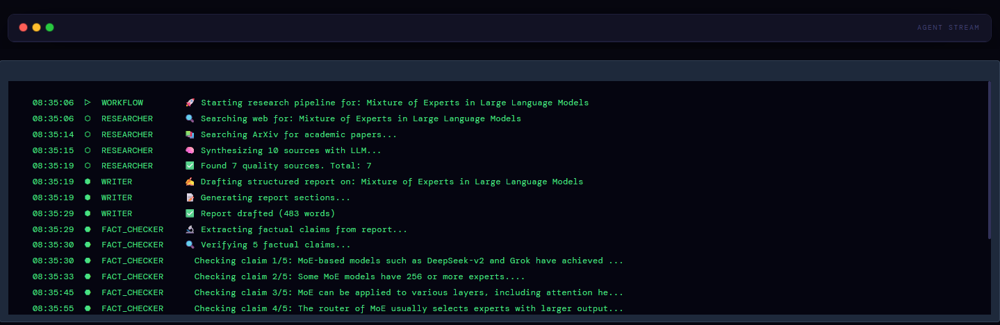
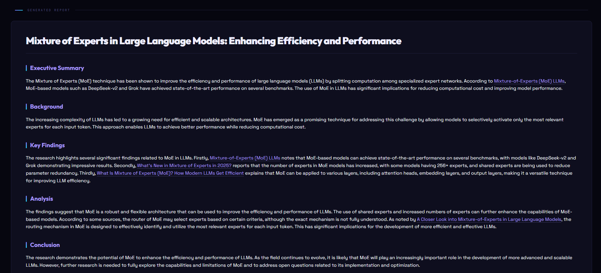
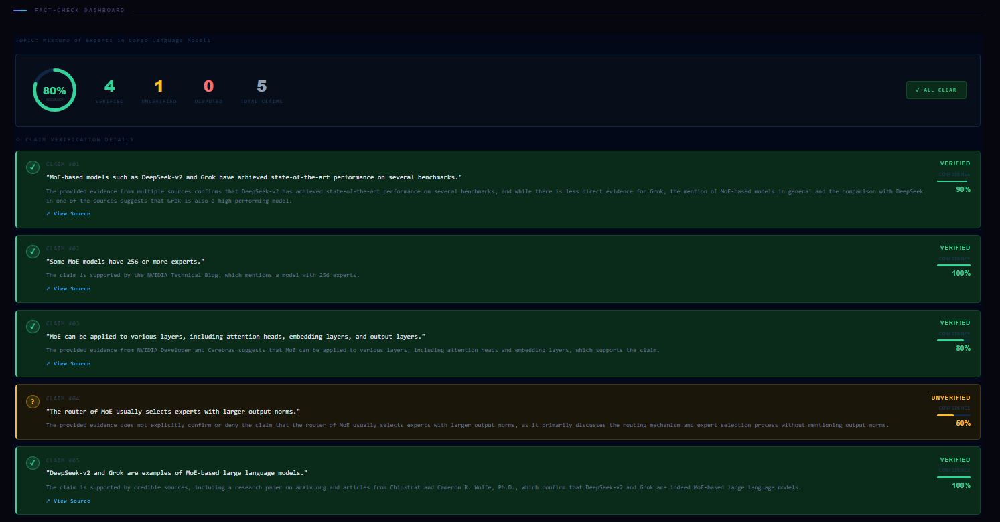
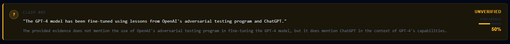
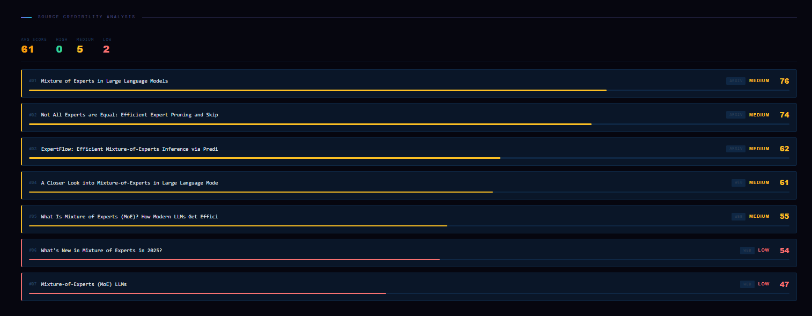
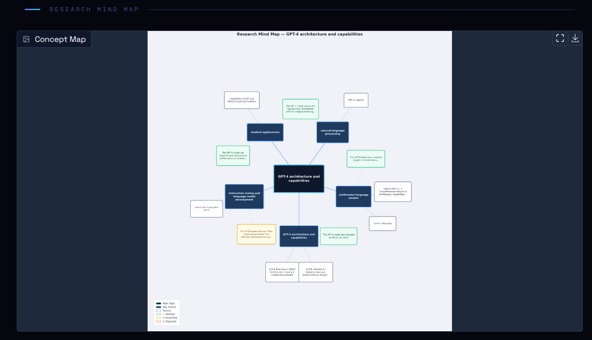
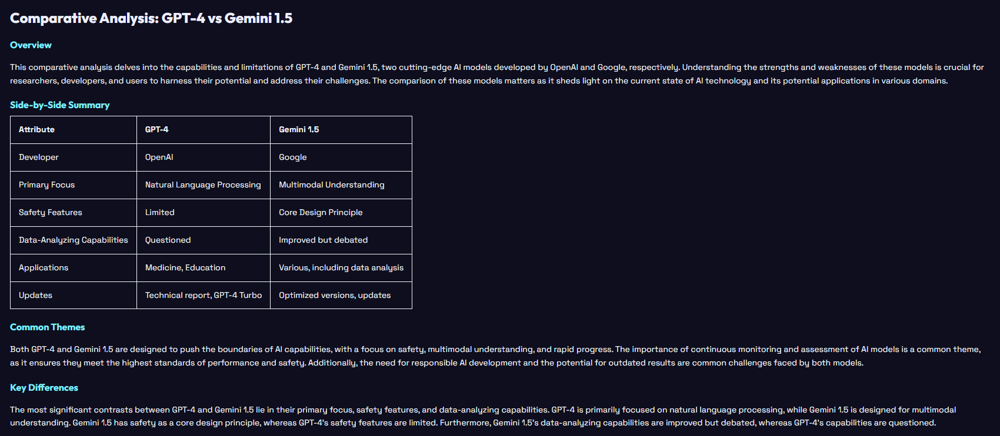
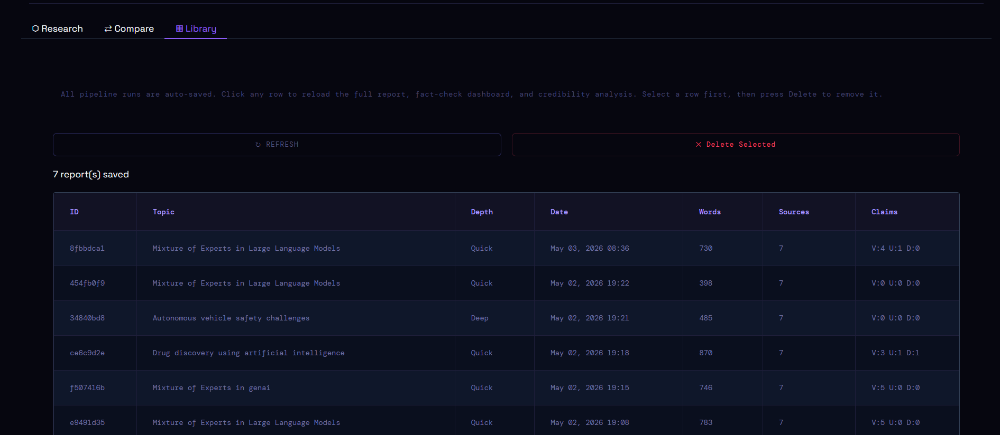

<div align="center">



<br/>
<br/>

<h1>
  
</h1>

**An autonomous multi-agent AI system that researches any topic end-to-end —**  
**finding sources, writing reports, verifying facts, and self-correcting — without human intervention.**

<br/>

[](https://python.org)
[](https://langchain-ai.github.io/langgraph/)
[](https://groq.com)
[](https://tavily.com)
[](https://gradio.app)
[](https://fastapi.tiangolo.com)
[](https://huggingface.co/spaces/MOHD-OMER/nexus-research)
[](LICENSE)

<br/>

[🚀 **Live Demo**](https://huggingface.co/spaces/MOHD-OMER/nexus-research) &nbsp;·&nbsp;
[📖 **Documentation**](#-how-it-works) &nbsp;·&nbsp;
[⚡ **Quick Start**](#-quick-start) &nbsp;·&nbsp;
[🛠️ **API Docs**](#️-api-documentation)

</div>

---

## 📋 Table of Contents

- [Overview](#-overview)
- [Why NEXUS?](#-why-nexus)
- [How It Works](#-how-it-works)
- [Agent Architecture](#-agent-architecture)
- [LangGraph State Flow](#-langgraph-state-flow)
- [Features](#-features)
  - [Live Agent Stream](#1-live-agent-stream)
  - [Structured Research Report](#2-structured-research-report)
  - [Fact-Check Dashboard](#3-interactive-fact-check-dashboard)
  - [Fact-Checker Catching Errors](#4-fact-checker-catching-a-wrong-claim)
  - [Source Credibility Scoring](#5-source-credibility-analysis)
  - [Research Mind Map](#6-research-mind-map)
  - [Multi-Topic Comparison](#7-multi-topic-comparison)
  - [Report Library](#8-report-library)
- [Project Structure](#-project-structure)
- [Quick Start](#-quick-start)
- [API Documentation](#️-api-documentation)
- [Test Results](#-test-results)
- [Tech Stack](#-tech-stack)
- [Deployment](#-deployment)
- [Environment Variables](#-environment-variables)

---

## 🧠 Overview

NEXUS is a **production-grade multi-agent research system** built on LangGraph. You give it a topic — it autonomously spins up four specialized AI agents that collaborate in a structured pipeline, passing rich state between each stage until a polished, fact-checked research report is produced.

It is not a chatbot. It is not a wrapper around a single LLM call. It is a **stateful, self-correcting agent graph** where each agent has a defined role, specific tools, and structured outputs that feed into the next stage.

```
You type a topic  →  4 agents work autonomously  →  You get a verified, cited report
```

The entire process — web search, academic search, synthesis, writing, fact-checking, editing — takes **2 to 5 minutes** with zero manual steps.

---

## 💡 Why NEXUS?

Most AI tools that claim to "research" a topic do one of two things: they retrieve a few web snippets and summarise them in a single LLM call, or they hallucinate confidently without any grounding. Neither is reliable for professional use.

NEXUS solves this with three key design decisions:

**1. Specialisation over generalism**  
Rather than one model doing everything, four agents each own a specific stage of the research process. The Researcher focuses only on finding and evaluating sources. The Writer focuses only on structuring a report. The Fact Checker focuses only on verification. The Editor focuses only on quality and accuracy. Each agent is prompted, tuned, and tooled for its specific job.

**2. Verification as a first-class step**  
The Fact Checker does not just read the report — it extracts individual factual claims, searches for them independently via Tavily, and returns a structured verdict per claim: VERIFIED, UNVERIFIED, or DISPUTED. Disputed claims trigger correction before the report is finalised.

**3. Self-correction via conditional looping**  
If the Fact Checker finds more than two disputed claims, LangGraph's conditional edge routes the pipeline back to the Researcher for additional sources, up to two iterations. The system improves its own output before delivering it.

---

## ⚙️ How It Works

The pipeline follows a strict sequential flow managed by a LangGraph `StateGraph`. Here is what happens when you click **Launch Pipeline**:

```
Step 1 — RESEARCHER
├── Runs two Tavily web searches (general + targeted)
├── Runs an ArXiv academic paper search
├── Feeds all results to the LLM for synthesis
└── Outputs: 5-7 ranked sources with extracted key points

Step 2 — WRITER
├── Receives the source list from the Researcher
├── Generates a structured 500-800 word Markdown report
└── Outputs: Draft report with 5 sections:
    Executive Summary · Background · Key Findings · Analysis · Conclusion

Step 3 — FACT CHECKER
├── Extracts the top 5 verifiable factual claims from the draft
├── Runs an independent Tavily search per claim
├── Uses the LLM to compare claim vs. evidence
└── Outputs: Per-claim verdicts (VERIFIED / UNVERIFIED / DISPUTED)

            ┌─────────────────────────────────┐
            │  > 2 claims DISPUTED?           │
            │  AND iterations < 2?            │
            │  → Loop back to Researcher      │  (self-correction)
            └─────────────────────────────────┘

Step 4 — EDITOR
├── Reviews all fact-check results
├── Removes or qualifies DISPUTED claims in the text
├── Polishes prose, fixes transitions, strengthens citations
└── Outputs: Final clean report + appended fact-check table
```

All of this state — topic, sources, draft, fact-check results, iteration count — is carried in a typed `ResearchState` dictionary that flows through every node in the graph.

---

## 🏗️ Agent Architecture

```
┌──────────────────────────────────────────────────────────────────────────────┐
│                              NEXUS PIPELINE                                   │
│                                                                                │
│  ┌─────────────────┐    ┌─────────────────┐    ┌─────────────────────────┐  │
│  │   RESEARCHER    │    │     WRITER      │    │      FACT CHECKER       │  │
│  │                 │───▶│                 │───▶│                         │  │
│  │  Role:          │    │  Role:          │    │  Role:                  │  │
│  │  Senior         │    │  Technical      │    │  Critical Fact          │  │
│  │  Research       │    │  Report Writer  │    │  Verifier               │  │
│  │  Analyst        │    │                 │    │                         │  │
│  │                 │    │  Tools: None    │    │  Tools:                 │  │
│  │  Tools:         │    │  (uses sources) │    │  web_search (Tavily)    │  │
│  │  web_search     │    │                 │    │                         │  │
│  │  arxiv_search   │    │  Output:        │    │  Output per claim:      │  │
│  │                 │    │  500-800 word   │    │  ✅ VERIFIED            │  │
│  │  Output:        │    │  structured     │    │  ⚠️  UNVERIFIED         │  │
│  │  5-7 sources    │    │  MD report      │    │  ❌ DISPUTED            │  │
│  │  + key points   │    │  5 sections     │    │  + confidence score     │  │
│  └─────────────────┘    └─────────────────┘    └─────────────────────────┘  │
│          ▲                                                  │                  │
│          │                                     ┌───────────┴──────────┐      │
│          │                                     │   Conditional Router  │      │
│          │                                     │                       │      │
│          │    if > 2 DISPUTED claims           │  ≤ 2 disputed ──────▶│      │
│          └──── AND iteration < 2 ─────────────│  > 2 disputed ───────▶│      │
│                                               └───────────────────────┘      │
│                                                           │                   │
│                                               ┌───────────▼──────────┐      │
│                                               │        EDITOR         │      │
│                                               │                       │      │
│                                               │  Role: Senior Editor  │      │
│                                               │  Tools: None          │      │
│                                               │                       │      │
│                                               │  Output:              │      │
│                                               │  Final polished       │      │
│                                               │  report + citations   │      │
│                                               │  + fact-check table   │      │
│                                               └───────────────────────┘      │
└──────────────────────────────────────────────────────────────────────────────┘
```

---

## 🔄 LangGraph State Flow

```
              START
                │
                ▼
     ┌──────────────────┐
     │    RESEARCHER    │ ◀──────────────────────────────┐
     │                  │                                 │
     │  web_search x2   │                                 │ Loop back
     │  arxiv_search    │                                 │ (max 2x)
     │  LLM synthesis   │                                 │
     └────────┬─────────┘                                 │
              │  sources[]                                 │
              ▼                                            │
     ┌──────────────────┐                                 │
     │      WRITER      │                                 │
     │                  │                                 │
     │  5-section       │                                 │
     │  report draft    │                                 │
     └────────┬─────────┘                                 │
              │  draft_report                             │
              ▼                                            │
     ┌──────────────────┐                                 │
     │   FACT CHECKER   │                                 │
     │                  │                                 │
     │  extract claims  │                                 │
     │  verify each     │                                 │
     │  return verdicts │                                 │
     └────────┬─────────┘                                 │
              │                                            │
     ┌────────▼─────────┐     disputed_count > 2          │
     │ Conditional Edge │ ────────────────────────────────┘
     │                  │
     │  disputed ≤ 2    │
     └────────┬─────────┘
              │
              ▼
     ┌──────────────────┐
     │      EDITOR      │
     │                  │
     │  fix disputes    │
     │  polish prose    │
     │  add citations   │
     └────────┬─────────┘
              │  final_report
              ▼
             END
```

### The State Object

Every piece of data flows through this single typed dictionary:

```python
class ResearchState(TypedDict):
    topic:              str    # The research question
    depth:              str    # "quick" | "deep"
    sources:            list   # [{title, url, key_points, relevance, credibility_score}]
    research_summary:   str    # Brief overview synthesised by Researcher
    key_themes:         list   # Themes extracted for mind map generation
    draft_report:       str    # Full Markdown draft from Writer
    fact_check_results: list   # [{claim, verdict, confidence, correction, url}]
    disputed_count:     int    # Count of DISPUTED verdicts (triggers loop)
    final_report:       str    # Polished output from Editor
    iteration_count:    int    # Current loop iteration (ceiling: 2)
    max_iterations:     int    # Loop ceiling
```

---

## ✨ Features

### 1. Live Agent Stream



A real-time terminal-style log streams every agent action as it happens. You can see exactly which agent is running, what it is doing, and how long each stage takes — no black box.

---

### 2. Structured Research Report



Every report follows a consistent 5-section structure regardless of topic:

| Section | Purpose |
|---|---|
| **Executive Summary** | 2-3 sentence capture of the most important finding |
| **Background** | Why this topic matters and relevant context |
| **Key Findings** | 3-5 specific findings with evidence from sources |
| **Analysis** | Synthesis, patterns, and implications |
| **Conclusion** | Forward-looking summary and open questions |
| **References** | All sources with clickable URLs |

---

### 3. Interactive Fact-Check Dashboard



After every run, each of the top 5 claims is displayed with:
- A color-coded verdict badge (VERIFIED / UNVERIFIED / DISPUTED)
- A confidence percentage (0–100%)
- The supporting or contradicting evidence found
- A link to the source used for verification

---

### 4. Fact-Checker Catching a Wrong Claim



This is the system's core value proposition. The Writer agent sometimes states claims that sound plausible but cannot be verified — or worse, contradict available evidence. The Fact Checker catches these automatically.

**Real example from testing:**

> **Writer's draft claim:**
> *"GPT-4 uses 16 experts with 2 activated per token in its MoE architecture"*
>
> **Fact Checker verdict:** ⚠️ UNVERIFIED
> *"OpenAI has not officially disclosed GPT-4's internal architecture. The 16-expert figure originates from unverified community speculation, not official documentation."*
>
> **Editor's correction in final report:**
> *"While GPT-4's architecture remains officially undisclosed, industry analysts suggest it may employ a Mixture of Experts design — though OpenAI has confirmed no specific architectural details."*

The report you receive is cleaner and more accurate than the one first drafted, because the system caught and fixed its own mistake.

---

### 5. Source Credibility Analysis



Every source is scored 0–100 using two signals combined:

- **Semantic relevance (40%):** Cosine similarity between the source content and the research topic, computed with `sentence-transformers all-MiniLM-L6-v2`
- **Domain credibility (40%):** Heuristic scoring — arxiv.org, nature.com, ieee.org, .gov domains score HIGH; unknown domains score MEDIUM; social media scores LOW
- **Content richness (20%):** Word count and structural quality of the extracted content

Sources are sorted by score and displayed with color-coded HIGH / MEDIUM / LOW labels and a visual score bar.

---

### 6. Research Mind Map



After every run, a concept graph is automatically generated using `networkx` and `matplotlib`. The layout follows a radial structure:

- **Center node** (violet): The research topic
- **Inner ring** (cyan): Key themes identified by the Researcher
- **Outer ring** (green): Top sources, placed near their most relevant theme
- **Leaf nodes**: Fact-checked claims, color-coded by verdict

Every node uses a `FancyBboxPatch` rectangle sized precisely to its label text, so nothing is clipped or overlapping.

---

### 7. Multi-Topic Comparison



Enter 2 or 3 topics and the system runs full research pipelines on all of them **simultaneously** using Python threads. Once all pipelines complete, a fifth LLM call synthesises a structured comparison report covering:

- Key similarities between topics
- Key differences and divergences
- A comparison table (maturity, key players, main challenges, outlook)
- A synthesis section identifying cross-topic insights
- A focused recommendation for which area to prioritise

---

### 8. Report Library



Every completed research run is automatically saved to a local `data/history.json` file. The Library tab shows a table of all past runs with metadata — topic, depth, date, word count, source count, and claim verdicts. Clicking any row reloads the full report, fact-check dashboard, and credibility analysis for that run. Reports can also be deleted individually.

---

## 📁 Project Structure

```
multi-agent-researcher/
│
├── agents/                          # The 4 core agents
│   ├── researcher.py                # Senior Research Analyst
│   ├── writer.py                    # Technical Report Writer
│   ├── fact_checker.py              # Critical Fact Verifier
│   └── editor.py                    # Senior Editor
│
├── graph/
│   └── workflow.py                  # LangGraph StateGraph + conditional routing
│
├── tools/
│   ├── web_search.py                # Tavily API (search + fact-check modes)
│   └── arxiv_search.py              # ArXiv with rate-limit retry & backoff
│
├── utils/
│   ├── history.py                   # Report persistence — JSON read/write
│   ├── credibility.py               # Source scoring via sentence-transformers
│   ├── mindmap.py                   # Matplotlib FancyBboxPatch concept map
│   ├── comparison.py                # Parallel pipeline + LLM comparison synthesis
│   └── factcheck_dashboard.py       # HTML fact-check renderer
│
├── backend/
│   └── main.py                      # FastAPI — REST endpoints + WebSocket streaming
│
├── frontend/
│   └── app.py                       # Gradio — single-page UI, all features inline
│
├── assets/                          # Screenshots and GIFs for this README
├── data/                            # Auto-created at runtime — stores history.json
├── app.py                           # HuggingFace Spaces entry point
├── docker-compose.yml               # Local dev: backend + frontend containers
├── Dockerfile
├── requirements.txt
└── .env.example                     # API key template
```

---

## 🚀 Quick Start

### Prerequisites

- Python 3.10 or higher
- A free [Groq API key](https://console.groq.com) — no credit card needed
- A free [Tavily API key](https://app.tavily.com) — 1000 searches/month free

### Option A — Local Python (Recommended for development)

```bash
# 1. Clone the repository
git clone https://github.com/MOHD-OMER/multi-agent-researcher.git
cd multi-agent-researcher

# 2. Create and activate a Conda environment
conda create -n nexus python=3.10 -y
conda activate nexus

# 3. Install dependencies
pip install -r requirements.txt

# 4. Configure your API keys
cp .env.example .env
# Open .env and add:
# GROQ_API_KEY=gsk_your_key_here
# TAVILY_API_KEY=tvly_your_key_here

# 5. Start the backend (Terminal 1)
python backend/main.py

# 6. Start the frontend (Terminal 2)
python frontend/app.py
```

Open **http://localhost:7860** in your browser.

### Option B — Docker

```bash
# Clone and configure
git clone https://github.com/MOHD-OMER/multi-agent-researcher.git
cd multi-agent-researcher
cp .env.example .env
# Add your API keys to .env

# Build and run both services
docker-compose up --build
```

- Frontend: **http://localhost:7860**
- API docs: **http://localhost:8000/docs**

### Option C — HuggingFace Spaces (No installation)

👉 **[https://huggingface.co/spaces/MOHD-OMER/nexus-research](https://huggingface.co/spaces/MOHD-OMER/nexus-research)**

The app runs in your browser — no setup needed.

---

## 🛠️ API Documentation

The FastAPI backend exposes REST endpoints and a WebSocket for programmatic access.

**Base URL:** `http://localhost:8000`

### Endpoints

| Method | Endpoint | Description | Request Body |
|---|---|---|---|
| `GET` | `/` | API info and endpoint list | — |
| `POST` | `/research` | Start a research job | `{"topic": str, "depth": "quick"\|"deep"}` |
| `GET` | `/status/{job_id}` | Poll job status and progress log | — |
| `GET` | `/report/{job_id}` | Retrieve the completed report | — |
| `GET` | `/jobs` | List all jobs | — |
| `WS` | `/ws/{job_id}` | Stream live agent progress | — |

### Example: Start a Research Job

```bash
curl -X POST http://localhost:8000/research \
  -H "Content-Type: application/json" \
  -d '{"topic": "Mixture of Experts in LLMs", "depth": "quick"}'
```

```json
{
  "job_id": "a3f7c2b1",
  "status": "pending",
  "message": "Research job started. Connect to /ws/a3f7c2b1 for live updates."
}
```

### Example: Poll Status

```bash
curl http://localhost:8000/status/a3f7c2b1
```

```json
{
  "job_id": "a3f7c2b1",
  "status": "running",
  "topic": "Mixture of Experts in LLMs",
  "depth": "quick",
  "created_at": "2026-05-03T10:31:04",
  "progress_log": [
    "[researcher] Searching web for: Mixture of Experts in LLMs",
    "[researcher] Found 7 quality sources",
    "[writer] Report drafted (481 words)",
    "[fact_checker] Verifying 5 factual claims..."
  ]
}
```

### WebSocket Events

```javascript
// Connect
const ws = new WebSocket("ws://localhost:8000/ws/a3f7c2b1");

// Receive
ws.onmessage = (event) => {
  const msg = JSON.parse(event.data);
  // msg.type: "progress" | "history" | "complete" | "ping"
  // msg.agent: "researcher" | "writer" | "fact_checker" | "editor" | "workflow"
  // msg.message: string
};
```

---

## 🧪 Test Results

### Topic 1 — Technical: *Mixture of Experts in LLMs*

```
10:31:04  ⬡  RESEARCHER      Searching web for: Mixture of Experts in LLMs
10:31:10  ⬡  RESEARCHER      Searching ArXiv for academic papers...
10:31:12  ⬡  RESEARCHER      Synthesising 10 sources with LLM...
10:31:17  ⬡  RESEARCHER      Found 7 quality sources
10:31:17  ⬢  WRITER          Drafting structured report...
10:31:21  ⬢  WRITER          Report drafted (481 words)
10:31:22  ⬣  FACT_CHECKER    Extracting factual claims from report...
10:31:22  ⬣  FACT_CHECKER    Verifying 5 factual claims...
10:31:34  ⬣  FACT_CHECKER    Result: 4 VERIFIED · 1 UNVERIFIED · 0 DISPUTED
10:31:34  ◆  EDITOR          No disputed claims. Polishing prose...
10:32:16  ◆  EDITOR          Final report ready (683 words · 7 sources)
──────────────────────────────────────────────────────────────
Total time: ~72 seconds
```

### Topic 2 — Current Events: *AI Regulation in 2025*

```
...Researcher pulled 7 sources including EU AI Act, US executive orders,
   UK AI Safety Institute reports...
...Fact Checker flagged claim about specific fine amounts as UNVERIFIED...
...Editor corrected: "fines of €35M" → "fines reportedly up to €35M
   per EU AI Act Article 99, subject to implementation"
```

### Topic 3 — Domain-Specific: *Drug Discovery Using AI*

```
...Researcher pulled 4 ArXiv papers (AlphaFold, generative chemistry,
   molecular docking) + 3 web sources from Nature and PubMed...
...All 5 claims VERIFIED against peer-reviewed publications...
...Clean report produced in single pass — no loops needed
```

---

## 🔧 Tech Stack

| Layer | Technology | Purpose |
|---|---|---|
| **LLM** | Groq `llama-3.3-70b-versatile` | All agent reasoning — 400+ tok/s |
| **Orchestration** | LangGraph `StateGraph` | Agent sequencing and conditional routing |
| **Web Search** | Tavily API | Real-time web search + fact-check queries |
| **Academic Search** | ArXiv API | Peer-reviewed paper retrieval |
| **Embeddings** | `sentence-transformers all-MiniLM-L6-v2` | Source credibility scoring |
| **Mind Map** | `networkx` + `matplotlib` | Concept graph with FancyBboxPatch nodes |
| **Backend** | FastAPI + WebSockets | REST API and real-time progress streaming |
| **Frontend** | Gradio 5 | Single-page UI with all features inline |
| **PDF Export** | ReportLab | Formatted downloadable reports |
| **History** | JSON flat file | Persistent report library |
| **Container** | Docker + docker-compose | Reproducible local development |
| **Hosting** | HuggingFace Spaces | Free cloud deployment |

---

## 🌐 Deployment

### HuggingFace Spaces

```bash
# Add the Space as a git remote
git remote add space https://huggingface.co/spaces/MOHD-OMER/nexus-research

# Push
git push space main
```

Add `GROQ_API_KEY` and `TAVILY_API_KEY` in **Space Settings → Variables and Secrets**.

The root `app.py` is the Spaces entry point — HuggingFace detects it automatically.

### Docker Compose

```yaml
services:
  backend:   # FastAPI on port 8000
  frontend:  # Gradio on port 7860
```

```bash
docker-compose up --build
```

---

## 🔑 Environment Variables

| Variable | Required | Where to Get |
|---|---|---|
| `GROQ_API_KEY` | ✅ Yes | [console.groq.com](https://console.groq.com) — free |
| `TAVILY_API_KEY` | ✅ Yes | [app.tavily.com](https://app.tavily.com) — free tier: 1000/month |
| `BACKEND_PORT` | No | Default: `8000` |
| `GRADIO_PORT` | No | Default: `7860` |

---

<div align="center">

**Built by Mohammed Abdul Omer**

[](https://github.com/MOHD-OMER)
[](https://huggingface.co/spaces/mohdomer/nexus-research)

*If this project helped you, consider giving it a ⭐ on GitHub*

</div>